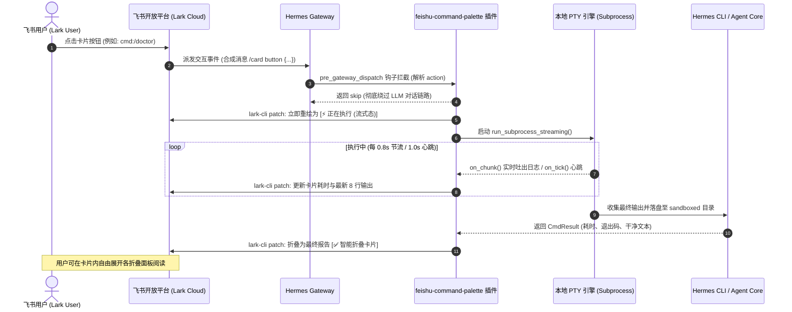

# Hermes Feishu Command Palette (飞书交互式控制面板)

<p align="center">
  <b>基于飞书 CardKit 原生交互的 Hermes Agent 单卡片原地控制面板 · PTY 终端流式 · 智能折叠抽屉 · 零刷屏执行</b>
</p>

<!-- Badge Row 1: Core Info -->
[](https://github.com/billzai/hermes-feishu-panel)
[](https://gitee.com/biu_zai/hermes-feishu-panel)
[](https://github.com/billzai/hermes-feishu-panel)
[](https://github.com/NousResearch/hermes-agent/pull/122519)

<!-- Badge Row 2: Tech Stack & Compatibility -->
[](https://python.org)
[](https://github.com/NousResearch/hermes-agent)
[](https://open.feishu.cn)
[](https://open.feishu.cn)

<!-- Badge Row 3: Platforms -->
[](https://github.com/billzai/hermes-feishu-panel)
[](https://github.com/billzai/hermes-feishu-panel)
[](https://github.com/billzai/hermes-feishu-panel)
[](https://github.com/billzai/hermes-feishu-panel)

<!-- Badge Row 4: License -->
[](LICENSE)

---

## 📖 目录 / Table of Contents

- [中文说明 (Chinese)](#中文说明)
  - [1. 痛点与核心价值](#1-痛点与核心价值)
  - [2. 核心特性矩阵](#2-核心特性矩阵)
  - [3. 系统架构与交互时序](#3-系统架构与交互时序)
  - [4. 前置要求与快速安装](#4-前置要求与快速安装)
  - [5. 界面使用与命令清单](#5-界面使用与命令清单)
  - [6. 安全设计与权限模型](#6-安全设计与权限模型)
  - [7. 常见问题排查 FAQ](#7-常见问题排查-faq)
- [English Documentation](#english-documentation)
  - [1. Motivation & Core Value](#1-motivation--core-value)
  - [2. Key Features](#2-key-features)
  - [3. Architecture & Sequence](#3-architecture--sequence)
  - [4. Requirements & Installation](#4-requirements--installation)
  - [5. Command Palette Matrix](#5-command-palette-matrix)
  - [6. Security & Disclosure](#6-security--disclosure)
  - [7. Troubleshooting FAQ](#7-troubleshooting-faq)

---

# 中文说明

## 1. 痛点与核心价值

在常规的 IM 机器人对接模式中，运维与操作 Agent 面临四大痛点：
1. **多消息刷屏骚扰**：每次执行命令（如查看状态或切换模型）就下发一条新卡片或文本，导致团队群聊天记录瞬间被淹没；
2. **长诊断命令假死与超时**：像 `/doctor` 这种执行超过 30 秒的重型分析命令，用户看不到实时反馈，极易误以为进程挂起，并常被 50s 阈值强行误杀；
3. **长输出撑爆屏幕**：诊断与日志动辄上百行，用户在移动端需要翻动多屏，极难快速找到关键报错；
4. **权限裸奔与配置破坏**：缺乏权限门禁，任意群成员均可修改模型或开启极速模式（`/yolo`）；全量写入 YAML 还会直接抹杀用户的手写配置注释。

**Hermes Feishu Command Palette** 通过纯原生卡片流转、PTY 虚拟终端实时捕获、智能可折叠面板与 Fail-Closed RBAC 门禁，彻底解决上述所有工程难题。

---

## 2. 核心特性矩阵

- **🌐 首页中英文瞬时切换 (In-Place Language Toggle)**：状态栏集成 `[ 🇨🇳 CN ]` / `[ 🇬🇧 EN ]` 极简国旗状态按钮，默认纯中文（4字大字体，零截断），点击毫秒级原地重绘为纯英文，全链路二级菜单、选项卡与报告完美跟随解耦。
- **🎛️ 单卡片原地流转 (In-Place Lifecycle)**：从一级菜单导航、二级选项卡选择，到终端流式预览与最终报告，100% 在当前卡片内原地重绘，零新增消息骚扰。
- **📂 原生可折叠抽屉 (Native Collapsible Panels)**：全面适配飞书原生 `collapsible_panel` 组件。长输出（如 `/doctor` 的 17 项诊断）自动收纳为折叠抽屉，异常模块（`🔴`）与概览智能默认展开，健康模块默认收起，卡片高度永久保持在一屏内。
- **⚡ PTY 虚拟终端流式 (Terminal Streaming)**：采用系统伪终端（`pty.openpty()`）实时捕获子进程 stdout，配合 0.8s 滑动窗口动态节流刷新，拒绝黑盒死等。
- **⏱️ 分级自适应超时与静默心跳**：根据命令性质实施动态分级（普通命令 35s、重度备份 `/doctor` 120s），无输出静默期每 1.0s 自增心跳节拍，杜绝假死。
- **🛑 命令冷却与防抖机制**：高频连击与重试设 3.0s 滑动冷却窗口，阻断恶意重复派发，彻底消除飞书服务端 99992354 报错与进程风暴。
- **🛡️ Fail-Closed RBAC 鉴权 (读写分离)**：普通状态查询对会话成员开放；写操作（模型切换、配置修改、`/yolo`、`/stop`）强制校验 `FEISHU_ADMINS` 白名单，未配管理员默认禁止写入。
- **🔒 官方原子配置写入 (Safe Atomic Set)**：彻底废弃全盘覆写，改用官方 `hermes config set <key> <val>` CLI 原子更新，严格校验参数白名单，保留所有 YAML 注释。
- **📦 沙箱隔离存储 (Sandboxed Plugin Data)**：输出文件统一落盘至 `~/.hermes/plugin-data/feishu-command-palette/`（权限 `0700`），配备 7 天 TTL 自动清理，严禁侵入系统 `/tmp`。
- **🌐 英文优先双语 UI (Bilingual English-First)**：标题、按钮、状态行全面采用规范双语呈现，无缝衔接国内与国际开发者环境。

---

## 3. 系统架构与交互时序



---

## 4. 前置要求与快速安装

### 前置依赖环境

| 组件 | 最低版本要求 | 推荐版本 | 作用说明 |
|---|---|---|---|
| **Python** | ≥ 3.10 | 3.11+ | 需要现代 Union 语法 `str \| None` 支持 |
| **Hermes Agent** | ≥ 0.21.0 | 最新官方版本 | 插件生命周期与 `pre_gateway_dispatch` 钩子 |
| **lark-cli** | ≥ 1.0.0 | 1.0.96+ | **必须安装**：执行飞书卡片原子 Patch 与发送 |
| **PyYAML** | ≥ 6.0 | 6.0.3+ | 配置文件只读解析 |

> ⚠️ **关键外部依赖声明**：本插件使用宿主机操作员安装的 `lark-cli` 进行交互卡片发送与原地更新。
> 请确保已执行全局安装：`npm install -g @larksuiteoapi/lark-cli` 并完成登录认证。

### 安装方式（当前立即可用）

#### 途径一：通过 Hermes CLI 一键安装（推荐，当前立即可用）
Hermes 原生支持直接通过 Git 仓库安装并启用插件：

```bash
# 从 GitHub 仓库一键安装并启用
hermes plugins install billzai/hermes-feishu-panel --enable

# 或从 Gitee 国内源一键安装并启用（国内网络推荐）
hermes plugins install https://gitee.com/biu_zai/hermes-feishu-panel.git --enable

# 重载 Hermes Gateway 生效
systemctl --user restart hermes-gateway
```

#### 途径二：通过 Git 手动克隆安装（当前立即可用）
```bash
# 1. 克隆代码至本地插件目录 (GitHub 或 Gitee 二选一)
git clone https://github.com/billzai/hermes-feishu-panel.git ~/.hermes/plugins/feishu-command-palette
# 国内网络镜像克隆：
# git clone https://gitee.com/biu_zai/hermes-feishu-panel.git ~/.hermes/plugins/feishu-command-palette

# 2. 重载 Hermes Gateway 生效
systemctl --user restart hermes-gateway
```

---

## 5. 界面使用与命令清单

在飞书任意与机器人关联的私聊或群聊中发送 `/card` 即可调出主控制台：

```text
┌───────────────────────────────────────────────┐
│  ⌨️ Hermes Control Panel (控制面板)            │
│  🟢 **gemini-3.8-flash-high** · max           │
├───────────────────────┬───────────────────────┤
│ 💬 Session (会话管理)  │ ⚙️ Config (系统配置)   │
├───────────────────────┼───────────────────────┤
│ 🔧 Tools (工具研发)    │ ℹ️ Info (系统信息)     │
├───────────────────────┴───────────────────────┤
│  ⚡ **Quick Actions (快捷操作)**               │
│  🔄 **Switch Model** (模型切换)          [▶]  │
│  📊 **System Status** (系统状态)         [▶]  │
│  🆕 **New Session** (新建会话)           [▶]  │
│  ⏹ **Force Stop** (强制停止)             [▶]  │
└───────────────────────────────────────────────┘
```

### 31+ 真实 CLI 命令矩阵

| 分类 | 包含命令集合 | 交互行为与说明 |
|---|---|---|
| **💬 Session (会话管理)** | `/new` `/stop` `/status` `/context` `/usage` `/sessions` `/undo` `/retry` `/compress` `/background` | `/new` 与 `/stop` 具备 120s 临时令牌二次确认；`/undo` `/retry` 真实回滚会话；长会话列表自动放入可折叠抽屉。 |
| **⚙️ Config (系统配置)** | `/model` `/reasoning` `/personality` `/verbose` `/yolo` `/fast` `/codex-runtime` | 模型二级可视化下拉选择与切换；参数单选卡片原地生效；写配置强制管理员校验。 |
| **🔧 Tools (工具研发)** | `/diff` `/doctor` `/security` `/debug` `/logs` `/cron` `/plugins` `/skills` `/bundles` `/memory` | 健康体检与日志自动按模块切分为原生折叠面板，异常高亮展示；支持全量纯文本复制。 |
| **ℹ️ Info (系统信息)** | `/version` `/profile` `/config` `/whoami` | 真实直驱底层凭证查询（`hermes auth list`）与版本信息。 |

---

## 6. 安全设计与权限模型

### 1. 严格的沙箱文件隔离（杜绝 `/tmp` 泄漏）
所有执行产生的输出全量文本与超时快照均保存在：
```text
~/.hermes/plugin-data/feishu-command-palette/
```
- 目录权限严格设为 `0700`（仅 Agent 宿主用户有权读写）；
- 7 天 TTL 自动清理仅作用于该沙箱目录，彻底消除利用共享 `/tmp` 提权或信息泄露的漏洞。

### 2. 全员菜单浏览与所有者专属执行（Owner-Only Execution）
- **全员开放菜单浏览**：控制面板支持发到多人群聊。群内任意成员均可自由点击翻阅一级、二级、三级菜单（如查看支持的模型列表、参数备选项与指南说明），并可自由展开/折叠面板，绝不报权限错误；
- **执行命令与修改配置严格限定所有者**：所有真实命令执行（`/status`、`/doctor`、`/logs` 等）、会话操作（`/new`、`/stop` 等）、模型切换确认与参数修改**100% 仅限宿主实例所有者本人**操作；
- **他人点击一律拦截**：非所有者点击任何执行类按钮，卡片绝不拉起本地进程或更改配置，直接弹出拦截 Toast：`"⛔ Operation restricted to instance owner / 仅限实例所有者执行操作"`；
- **所有者配置方式**：在 `~/.hermes/.env` 中配置 `FEISHU_ADMINS=ou_xxxx` 指定所有者 Open ID；若未配置任何所有者，所有执行类操作一律拒绝（Fail-Closed），私聊与群聊均不会自动认领。

### 3. 入参白名单防御
- 切换模型前校验目标模型是否在当前生效的 `catalog` 范围内；
- 修改参数前比对 `val` 是否属于预设的合法枚举集合，阻断恶意 Action 参数注入。

---

## 7. 常见问题排查 FAQ

### Q1: 点击卡片按钮后无反应？
**A**:
1. 检查网关服务是否正常运行：`systemctl --user status hermes-gateway`；
2. 确认 `lark-cli` 是否安装并就绪：`lark-cli --version`；
3. 查看网关日志是否有报错：`tail -n 50 ~/.hermes/logs/gateway.log`。

### Q2: 提示 "Permission denied: Admin privileges required"？
**A**: 该按钮属于敏感写操作（修改模型或系统配置）。请在 `~/.hermes/.env` 中添加管理员的飞书 Open ID：
```bash
FEISHU_ADMINS=ou_xxxxxx,ou_yyyyyy
```
保存后重启网关即可。

### Q3: 折叠面板在飞书桌面端无法展开？
**A**: 飞书桌面端建议升级至 7.15+ 最新版本以获得对 CardKit 原生 `collapsible_panel` 的最佳交互支持。

---

# English Documentation

## 1. Motivation & Core Value

Operating autonomous AI agents via messaging platforms usually suffers from 4 major pain points:
1. **Message Flooding**: Every single command execution emits a new card or text message, rapidly cluttering chat history;
2. **Hangs on Long Diagnostics**: Heavy commands like `/doctor` take 30s+ with no feedback, making users think the agent crashed before being terminated by 50s timeouts;
3. **Screen Sprawl**: Massive textual outputs (100+ lines) force mobile users to scroll endlessly;
4. **Privilege & Config Risks**: Unrestricted actions allow any group member to toggle `/yolo`, while raw YAML file overwrites strip out user comments.

**Hermes Feishu Command Palette** completely eliminates these issues through in-place lifecycle transitions, PTY live streaming, native collapsible panels, and fail-closed RBAC gates.

---

## 2. Key Features

- **🌐 In-Place Language Switching**: Seamless `[ 🇨🇳 CN ]` / `[ 🇬🇧 EN ]` flag toggle directly on the status bar. Pure Chinese by default (zero truncation on mobile), switchable to pure English instantly with full sub-menu and report localization.
- **🎛️ In-Place Lifecycle Transitions**: Root menus, sub-options, live streaming previews, and final reports all render within the same card. Zero spam.
- **📂 Native Collapsible Panels**: Deep integration with Lark's native `collapsible_panel`. Complex outputs (e.g. `/doctor`'s 17 sections) fold into clean drawers. Warnings/errors expand automatically; healthy sections collapse by default.
- **⚡ PTY Live Terminal Streaming**: Uses system pseudo-terminals (`pty.openpty()`) to capture live process output, refreshed smoothly at 0.8s intervals.
- **⏱️ Tiered Adaptive Timeouts & Silent Heartbeat**: Command-aware budget allocation (`/doctor` 120s, regular 35s) paired with 1.0s incrementing heartbeat ticks during silent execution phases.
- **🛑 Debounce & Cooldown Engine**: 3.0s sliding cooldown prevents rapid re-clicks and process storms.
- **🛡️ Owner-Only Execution & Public Browsing**: Everyone can navigate menus, switch options, and fold drawers. Command execution, model switching, and settings are strictly locked to the instance owner (`FEISHU_ADMINS`). Non-owners clicking execution buttons are safely blocked with zero host processes spawned.
- **🔒 Safe Atomic Config Updates**: Uses official `hermes config set <key> <val>` CLI with parameter whitelisting. Preserves all YAML comments.
- **📦 Isolated Sandboxed Storage**: Process outputs are stored under `~/.hermes/plugin-data/feishu-command-palette/` (0700) with a 7-day TTL auto-purge. Zero `/tmp` pollution.
- **🌐 English-First Bilingual UI**: Standardized English UI with concise bilingual subtitles for seamless global usage.

---

## 3. Architecture & Sequence

```text
Lark User
   │  Clicks Card Button (cmd:/doctor)
   ▼
Lark Cloud (card.action.trigger)
   │  Routes as synthetic command: /card button {...}
   ▼
Hermes Gateway
   │  pre_gateway_dispatch hook intercepts
   ▼
feishu-command-palette Plugin
   │  Returns skip -> Bypasses LLM turn completely
   ├─► Lark Cloud: lark-cli patch (Updates to [⚡ Running Stream Card])
   ├─► Local PTY: Runs subprocess with non-blocking select
   │     │
   │     ├── on_chunk / on_tick (Every 0.8s) ─► lark-cli patch (Live log ticker)
   │     │
   │     └── On Exit ─► Saves output to sandboxed directory
   │
   └─► Lark Cloud: lark-cli patch (Folds into [✅ Native Collapsible Report])
```

---

## 4. Requirements & Installation

### Requirements

| Dependency | Minimum Version | Note |
|---|---|---|
| **Python** | ≥ 3.10 | Required for modern union syntax |
| **Hermes Agent** | ≥ 0.21.0 | Required for plugin hook runtime |
| **lark-cli** | ≥ 1.0.0 | **Required**: `npm install -g @larksuiteoapi/lark-cli` |
| **PyYAML** | ≥ 6.0 | For reading configuration |

> ⚠️ **Disclosure**: This plugin uses the operator-installed `lark-cli` binary for card sending and in-place patching (`lark-cli im messages patch`).

### Installation (Currently Available Methods)

#### Method 1: Install Directly via Hermes CLI (Recommended)
Hermes natively supports installing and enabling plugins directly from Git repositories:

```bash
# Install directly from GitHub and enable
hermes plugins install billzai/hermes-feishu-panel --enable

# Or install from Gitee mirror and enable (Fast in China)
hermes plugins install https://gitee.com/biu_zai/hermes-feishu-panel.git --enable

# Restart Gateway to apply
systemctl --user restart hermes-gateway
```

#### Method 2: Clone Manually
```bash
# 1. Clone repository to your local plugins directory (GitHub or Gitee)
git clone https://github.com/billzai/hermes-feishu-panel.git ~/.hermes/plugins/feishu-command-palette
# Or using Gitee mirror:
# git clone https://gitee.com/biu_zai/hermes-feishu-panel.git ~/.hermes/plugins/feishu-command-palette

# 2. Restart Gateway to apply
systemctl --user restart hermes-gateway
```

---

## 5. Command Palette Matrix

Send `/card` in your Feishu/Lark chat to open the control panel.

| Category | Commands | Description |
|---|---|---|
| **💬 Session** | `/new` `/stop` `/status` `/context` `/usage` `/sessions` `/undo` `/retry` `/compress` `/background` | `/new` and `/stop` require 120s token confirmation; `/undo` rolls back turns; session lists fold automatically. |
| **⚙️ Config** | `/model` `/reasoning` `/personality` `/verbose` `/yolo` `/fast` `/codex-runtime` | Visual two-tier model selection; parameter adjustments take effect in-place; admin-gated. |
| **🔧 Tools** | `/diff` `/doctor` `/security` `/debug` `/logs` `/cron` `/plugins` `/skills` `/bundles` `/memory` | Multi-section diagnostic outputs fold into interactive drawers; full raw copy supported. |
| **ℹ️ Info** | `/version` `/profile` `/config` `/whoami` | Queries live credentials (`hermes auth list`) and framework versions. |

---

## 6. Security & Disclosure

> **Official Catalog Disclosure:**
> Answers the Feishu `/card` text with an interactive control card sent through the external `lark-cli` binary. Button clicks run a fixed table of local `hermes ...` CLI subcommands locally and post their formatted output (logs, sessions, redacted config/auth status) into the chat. Can update model/provider and `agent.*` settings (including `agent.yolo`) via official `hermes config set` CLI. Reads `auth.json` strictly for provider names. All temporary process outputs are sandboxed in `~/.hermes/plugin-data/feishu-command-palette/` (mode 0700).

---

## 7. Troubleshooting FAQ

- **Buttons have no response?** Ensure `systemctl --user status hermes-gateway` is active and `lark-cli --version` works.
- **Permission denied: Admin privileges required?** Add your Feishu Open ID to `FEISHU_ADMINS=ou_xxx` in `~/.hermes/.env` and restart the gateway.
- **Collapsible panels not expanding?** Update your Feishu/Lark client to version 7.15+ for optimal CardKit support.

---

## 📄 License

[MIT License](LICENSE) · Maintained by [@billzai](https://github.com/billzai)
